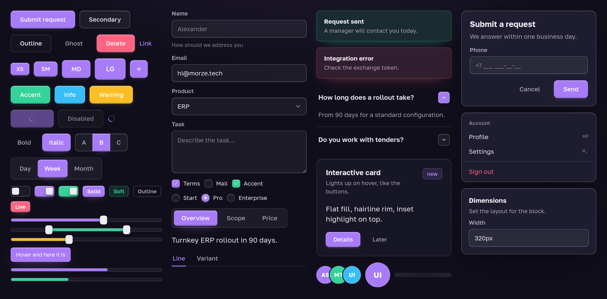

# @morze/ui

Morze UI — a React component kit shaped like **shadcn/ui (latest)** on **Radix**
primitives, wearing the convex look from the Morze landing: a flat fill, a
hairline rim, an inset highlight on top and a tone glow underneath.



```
background-color: rgb(tone);
border: 1px solid rgba(255,255,255,.18);
box-shadow: 0 3px 10px -4px rgba(tone,.4),
            inset 0 1px 0 rgba(255,255,255,.35),
            inset 0 -1px 0 rgba(0,0,0,.2);
```

That recipe is applied to **every active element**: buttons, toggles,
checkboxes, radios, switches, sliders, tabs, the select trigger, badges and the
active navigation item. **Every fill is one flat colour** — the volume is drawn
on the edges of a control, never washed across its face. The recipe carried a
135° gloss sweep until the fills were flattened; it survives as a hook that is
off by default (`--mz-fill-sheen`, and `--mz-face-sheen` / `--mz-glass-sheen`
for the neutral and frosted faces), so a host that wants the gloss back
re-points one token per family. The label stays flat for the same reason the
landing dropped it — the embossed `text-shadow` is off
(`--mz-convex-text-shadow: none`), because on a 34px control it only made the
text shout.

The surfaces that other content passes behind are **glass**: menus, popovers,
dialogs, the sheet, the sidebar rail and a sticky table header are a
translucent cut of the same surface ramp over a backdrop blur
(`--mz-glass*`), so a menu frosts the page under it and a pinned header
frosts the rows scrolling past. Controls stay convex and opaque — glass is
for what things float over, not for what you press. With
`prefers-reduced-transparency`, or in an engine without `backdrop-filter`,
the glass falls back to the opaque ramp.

## Install

```bash
npm i @morze/ui
```

`react` and `react-dom` **19** are peer dependencies: like shadcn after its
React 19 rewrite, components take `ref` as a plain prop and use no `forwardRef`.
Tailwind is **not required** — the package ships compiled CSS.

```tsx
// once, at the app root
import '@morze/ui/styles.css'

import { Button, Switch, MorzeThemeProvider } from '@morze/ui'

export default function App() {
  return (
    <MorzeThemeProvider defaultTheme="dark">
      <Button>Submit request</Button>
      <Switch defaultChecked />
    </MorzeThemeProvider>
  )
}
```

Tokens only, without components: `import '@morze/ui/tokens.css'`.

**In a Tailwind v4 host, import the kit into a layer.** The kit ships plain,
unlayered CSS, and unlayered CSS beats layered CSS regardless of source order —
imported naively, `.mz-btn--primary` outranks every utility passed through
`className`:

```css
/* Layer order first — @layer statements may precede @import. */
@layer theme, base, components, morze-ui, utilities;

@import 'tailwindcss';
@import '@morze/ui/styles.css' layer(morze-ui);
```

The kit then wins over the host's preflight, and a `className` on a component
still wins over the kit. Note that `cn` is plain `clsx`, not `tailwind-merge`:
conflicting classes are not de-duplicated, they are resolved by that cascade.

## Themes

Dark is the default, light is opt-in through an attribute (or the
`.mz-theme-light` / `.mz-theme-dark` classes if attributes are inconvenient):

```html
<html data-mz-theme="light">
```

`MorzeThemeProvider` does that for you, remembers the choice in `localStorage`
and understands `system`:

```tsx
const { resolvedTheme, setTheme } = useMorzeTheme()
setTheme('light') // 'dark' | 'light' | 'system'
```

The first render is always `defaultTheme`; the stored preference is applied in
an effect after mount, so server and client markup agree and hydration does not
break. Storage access is wrapped in try/catch — with site data blocked the
theme simply does not persist.

The provider renders a wrapper with the `mz-root` class (background and text
colour from the tokens). By default `data-mz-theme` is written to `<html>`, so
portalled dialogs and menus follow the theme too. `target="element"` scopes the
theme to the wrapper instead.

## Tones

Every active component accepts `tone`, which re-points the fill, the glow
and the focus ring:

```tsx
<Button tone="accent">Save</Button>
<Switch tone="success" defaultChecked />
<Badge tone="danger">Live</Badge>
<Progress value={40} tone="warning" />
```

`primary` (violet) · `accent`/`success` (emerald) · `danger` · `warning` ·
`info`. A tone is the `--mz-tone-rgb` custom property, so a one-off value works
too: `style={{ '--mz-tone-rgb': '255, 100, 130' }}` (channels separated by
commas — the value is substituted into `rgb()`/`rgba()`).

## Shape and type

The default shape is **rectangular**: one small radius for controls, a slightly
larger one for surfaces.

| Token | Value | Used by |
| --- | --- | --- |
| `--mz-radius-sm` | `6px` | items inside containers: menu items, tabs, checkbox |
| `--mz-radius` | `8px` | buttons, inputs, select, toggles, badges, alerts |
| `--mz-radius-lg` | `12px` | cards, dialogs, popovers, menus |
| `--mz-radius-pill` | `999px` | only what is round by meaning: the radio and its mark |

Fully square corners: `--mz-radius: 0; --mz-radius-sm: 0; --mz-radius-lg: 0`.

**The kit inherits your application's font.** Every `mz-` element is
`font-family: inherit`, so a button, a table cell and a menu item read in the
same face as the text around them — the kit never renders a label in a font the
page does not use. Control labels are plain sentence case.

`--mz-font-sans` is the fallback, applied to `.mz-root`: `'Golos Text'` (the
face morze.tech uses) with a system stack behind it. Nothing is downloaded —
load the webfont in the host if you want it:

```html
<link rel="preconnect" href="https://fonts.gstatic.com" crossorigin />
<link href="https://fonts.googleapis.com/css2?family=Golos+Text:wght@400..700&display=swap"
      rel="stylesheet" />
```

Set the font on `body`, not only inside the app shell: dialogs, menus and
tooltips are portalled to `<body>` and inherit from there.

The **leading** is the kit's own, though: `--mz-line` (1.45) is applied at zero
specificity to every `mz-` element, so a landing-style `line-height: 1.7` on
your body does not inflate a dialog description or a field hint. For the same
reason the kit zeroes the UA margins on the headings, paragraphs and lists it
renders itself — a host with no CSS reset used to get a dialog title pushed
14px away from its description. Your own markup inside a `Card` or `Dialog` is
untouched.

```css
body { font-family: var(--mz-font-sans); }

:root {
  --mz-primary-rgb: 120, 90, 250;   /* brand colour */
  --mz-font-sans: 'Inter', sans-serif;   /* or your own face */
  --mz-font-display: 'Unbounded', sans-serif;  /* headings only */
  --mz-radius: 4px;                 /* tighter */
}
```

To bring back the landing's own look (pills plus mono caps):

```css
:root {
  --mz-radius-control: var(--mz-radius-pill);
  --mz-label-font: 'JetBrains Mono', ui-monospace, monospace;
  --mz-label-transform: uppercase;
  --mz-label-tracking: 0.08em;
}
```

## States

Hover **darkens the colour** and grows the element slightly **in place** —
nothing shifts position, and there is no shine sweep. Press darkens further and
shrinks a little.

```css
:root {
  --mz-hover-scale: 1.02;   /* growth on hover */
  --mz-press-scale: 0.98;   /* dip on press */
  --mz-hover-mix: 88%;      /* fill colour: 88% tone + 12% black */
  --mz-press-mix: 80%;
}
```

The tone fill is a flat colour (`--mz-fill`), so `background-color` animates
smoothly; the neutral face (`--mz-face`) is flat for the same reason. Both used
to be split into a colour under a fixed sheen purely because browsers cannot
interpolate a gradient — with the sweeps gone, so is the split. Darkening goes
through `color-mix()`; where that is unsupported the element simply does not
darken and everything else still works.

Only **filled** surfaces darken: `primary`, `destructive`, a pressed toggle, the
active tab, a checked checkbox, radio or switch. Neutral variants (`secondary`,
`outline`, `ghost`) and unselected controls lighten instead — darkening would
sink them into the page.

## Customisation

**The neutrals carry a whisper of the brand.** Panels, inputs, table headers
and the sunken wells are a grey ramp with a few percent of `--mz-tint` mixed in
— three channel steps out of 255, enough that a surface is not flat cardboard,
not enough to name a colour. Dark runs the tint weaker than light (2.5% against
4%): there the brand is far lighter than the surfaces it sits in, so the same
percentage pulls a lot more hue. The tint follows `--mz-primary-rgb`, so the greys
move with the brand instead of keeping a violet cast that belongs to no one:

```css
:root {
  --mz-primary-rgb: 16, 175, 122;   /* panels and wells go faintly green */
  --mz-tint-strength: 0%;           /* …or take the hue out altogether */
  --mz-tint: #808080;               /* same thing, keeping the lightness */
}
```

The grey under each mix is pre-compensated, so at the default strength the ramp
lands on the same lightness it would have with no tint at all; raising the
strength lifts the surfaces slightly. Text is deliberately left out: its
contrast is calibrated, and a saturated brand dragged through it costs more than
it buys. The tinted surfaces need `color-mix()` — Chrome 111+, Firefox 113+,
Safari 16.2+, the same baseline as the rest of the kit.

Everything is driven by custom properties; override them after importing the
styles. The main groups: surfaces (`--mz-bg`, `--mz-surface`, `--mz-elevated`),
borders, text, tones, the convex recipe (`--mz-convex-*`, `--mz-face*`,
`--mz-well*`), the glass layer (`--mz-glass`, `--mz-glass-chrome`,
`--mz-glass-well`, `--mz-glass-filter`, `--mz-glass-sheen`),
geometry (`--mz-radius*`), type (`--mz-font-*`, `--mz-label-*`),
motion and states (`--mz-ease`, `--mz-duration`, `--mz-hover-scale`,
`--mz-press-scale`, `--mz-hover-mix`, `--mz-press-mix`), focus (`--mz-ring-*`).

The full list lives in `dist/morze-ui-tokens.css`.

## Components

| Input and actions | Navigation | Output | Overlays |
| --- | --- | --- | --- |
| `Button` `Toggle` `ToggleGroup` | `Tabs` `Accordion` | `Card` `Alert` `Badge` | `Dialog` `AlertDialog` |
| `Checkbox` `RadioGroup` `Switch` | `Sidebar` `Breadcrumb` | `Progress` `Avatar` | `DropdownMenu` `Menubar` |
| `Slider` `Input` `Textarea` | `Menubar` `NavigationMenu` | `Separator` `Skeleton` `Spinner` | `Popover` `Tooltip` |
| `Label` `Field` `Select` | `ScrollArea` | `Table` `Chart` | `Sheet` `Toast` |
| `Calendar` `DataTable` | | | |

The API mirrors shadcn/ui: same names, same sub-component composition,
`asChild`, a `data-slot` on every part — so examples from the shadcn docs work
with barely any edits.

What this kit adds on top:

- `Button` — `variant`: `primary` (default) `secondary` `outline` `ghost`
  `destructive` `link`; `size`: `xs` (28px) `sm` (34) `md` (40, default)
  `lg` (48) plus square `icon-xs` `icon-sm` `icon` `icon-lg`; `loading`,
  `tone`. The `sm/md/lg` heights (34/40/48px) are
  shared by buttons, inputs and toggles, so controls line up in a row. With
  `asChild` the loading indicator is grafted inside the child element and the
  blocked state is expressed through `aria-disabled`, since a link has no
  `disabled`.
- `Toggle` / `ToggleGroup` — `variant`: `default` `outline`; `size`: `xs` (28px)
  `sm` (34) `md` (40, default) `lg` (48), the same scale the buttons run on;
  `tone`. `ToggleGroup` also
  takes `appearance`: `segmented` (a sunken well with the active item raised),
  `joined` (one continuous bar), `spaced`. The group's `variant`, `size` and
  `tone` are the default for every item in it, and an item that sets its own
  still wins:

  ```tsx
  <ToggleGroup type="single" size="sm" appearance="joined" defaultValue="a">
    <ToggleGroupItem value="a">A</ToggleGroupItem>
    <ToggleGroupItem value="b" size="lg">B</ToggleGroupItem>
  </ToggleGroup>
  ```
- `TabsList` — `variant`: `default` (well) or `line` (underline).
- `Checkbox` / `Switch` / `Avatar` — `size`: `sm` `md` `lg`.
- `Input` — the size prop is `inputSize` (`sm` `md` `lg`); the name differs from
  shadcn to avoid clashing with the native `size` attribute on `<input>`.
- `SelectTrigger` — `size`: `sm` `md` (no `lg`).
- `Card` — `interactive` adds the hover state; combined with `onClick` the card
  also gets `role="button"`, `tabIndex` and Enter/Space activation.
- `Spinner` — `label` (default `Loading`) is announced by screen readers;
  `label={null}` makes it purely decorative.
- `Badge` — `variant`: `solid` `soft` `outline`.
- `Field` / `FieldHint` / `FieldError` — form scaffolding.
- `TabsList` — `overflow`: `wrap` (default), `scroll`, or `menu`, which
  collapses whatever does not fit into a trailing menu. See [Tabs that run out
  of room](#tabs-that-run-out-of-room).
- `AlertDialogAction` / `AlertDialogCancel` — `variant`, `size` and `tone` from
  `Button`, so a destructive confirmation is `tone="danger"`.
- `Table` — brings its own horizontal scroll container, because a wide table
  otherwise scrolls the page instead of itself; `containerRef` hands that
  element back for a synchronised header or a virtualiser.
- `ScrollArea` — the kit's scrollbar in place of the platform's, so a pane
  looks scrollable on macOS too. `viewportRef` reaches the scrolling element.

```tsx
<ToggleGroup type="single" defaultValue="week" appearance="segmented">
  <ToggleGroupItem value="day">Day</ToggleGroupItem>
  <ToggleGroupItem value="week">Week</ToggleGroupItem>
</ToggleGroup>
```

## Tabs that run out of room

`overflow="menu"` keeps a tab row on one line and folds the rest into a menu:

```tsx
<TabsList overflow="menu" overflowLabel="More">
  {sections.map((s) => <TabsTrigger key={s.id} value={s.id}>{s.name}</TabsTrigger>)}
</TabsList>
```

Every trigger stays mounted inside the list — Radix wires them into one
roving-focus group and a trigger outside it throws — so the collapsed ones are
hidden rather than unmounted, which also takes them out of the tab order. The
button lights up when the *selected* tab is one of the hidden ones, so the row
never looks as if nothing is chosen. Widths are measured off a mirror row of
inert spans: a hidden trigger measures zero, and a second row of real triggers
would duplicate every `value`.

## Calendar

A month grid with no date library behind it. Names come from `Intl`, so a
locale tag is the whole of the localisation story.

```tsx
<Calendar mode="single" selected={date} onSelect={setDate} locale="ru-RU" />

<Calendar
  mode="range"
  numberOfMonths={2}
  selected={range}
  onSelect={setRange}
  disabled={{ before: new Date() }}
/>
```

`mode`: `single` (clicking the chosen day clears it unless `required`),
`multiple`, `range` (the ends are ordered for you, and the span under the
pointer previews before you commit). `disabled` takes a `Date`, a `Date[]`, a
`{ from, to }` span, an open `{ before, after }` bound, or a predicate.
`fromDate` / `toDate` bound both selection and paging; `captionLayout="dropdown"`
swaps the caption for month and year selects; `showWeekNumbers` adds the ISO
column; `weekStartsOn` overrides what the locale says.

Six week rows are always drawn, so paging never resizes the popover it sits in.
Arrows move a day, `Home`/`End` a week, `PageUp`/`PageDown` a month, and exactly
one day is ever in the tab order.

## Toast

`Toaster` mounts once; `toast()` is a plain function, callable from a fetch
handler or a store — the places a failure actually happens are rarely places
that can call a hook.

```tsx
// once, at the root
<Toaster position="bottom-right" />

// anywhere
toast({ title: 'Saved', tone: 'success' })

const t = toast({ title: 'Uploading…', duration: Infinity })
t.update({ title: 'Uploaded', tone: 'success', duration: 4000 })
t.dismiss()
```

Three live at once; beyond that the oldest is dropped, because a taller stack
is a log and nobody reads a log that is covering the page. `useToast()` returns
the same `{ toasts, toast, dismiss }` for the rare case that needs to render
the queue itself.

## Chart

The kit does not draw charts — it dresses them. `ChartContainer` publishes each
series colour as a CSS custom property scoped to itself, so any library that
takes a CSS colour can consume it, and the tooltip and legend read like the
rest of the interface.

```tsx
const config = {
  shipped: { label: 'Shipped', color: 'var(--mz-primary)' },
  returned: { label: 'Returned', theme: { light: '#c2410c', dark: '#fb923c' } },
} satisfies ChartConfig

<ChartContainer config={config} className="h-64">
  <ResponsiveContainer>
    <BarChart data={rows}>
      <Bar dataKey="shipped" fill="var(--color-shipped)" />
      <Tooltip content={<ChartTooltipContent />} />
    </BarChart>
  </ResponsiveContainer>
</ChartContainer>
```

The responsive wrapper stays yours: sizing belongs to the charting library, and
a container that owned it would only ever work with one of them. Config values
are validated before they are interpolated into the stylesheet — a config is
data, and data ends up coming from a server.

`ChartTooltipContent` and `ChartLegendContent` take `nameKey` (and the tooltip
also `labelKey`) for the charts whose series key lives *inside* the datum
rather than in `dataKey` — a pie, where every slice comes from one series:

```tsx
<Tooltip content={<ChartTooltipContent nameKey="material" hideLabel />} />
```

`ChartTooltip` and `ChartLegend` are not exported: they were only ever
recharts' own `Tooltip` and `Legend`, so import those from recharts directly.

## Forms

React Hook Form bindings live behind their own entry point, because
`react-hook-form` is an *optional* peer dependency — an application that does
not use it should not carry it:

```tsx
import { Form, FormField, FormItem, FormLabel, FormControl, FormMessage }
  from '@morze/ui/form'

<Form {...form}>
  <FormField
    control={form.control}
    name="email"
    render={({ field }) => (
      <FormItem>
        <FormLabel>Email</FormLabel>
        <FormControl><Input {...field} /></FormControl>
        <FormMessage />
      </FormItem>
    )}
  />
</Form>
```

What it adds over `Field` is the wiring nobody enjoys writing: one generated id
per field, `htmlFor` on the label, `aria-describedby` pointing at both the
description and the message, and `aria-invalid` flipped by the field's own
state. `FormMessage` renders nothing at all when there is no error, so a form
does not reserve a blank line under every input.

Without React Hook Form, `Field` / `FieldHint` / `FieldError` from the main
entry are the same layout with none of the binding.

## Sidebar

A navigation column: it collapses into an icon rail, turns into a sliding sheet
on narrow screens and remembers its state between sessions.

```tsx
<SidebarProvider>
  <Sidebar collapsible="icon">
    <SidebarHeader>
      <Logo className="mz-sidebar-hide-collapsed" />
      <b className="mz-sidebar-hide-collapsed">Morze ERP</b>
      <SidebarTrigger className="mz-sidebar-push" />
    </SidebarHeader>
    <SidebarContent>
      <SidebarGroup>
        <SidebarGroupLabel>Work</SidebarGroupLabel>
        <SidebarMenu>
          <SidebarMenuItem>
            <SidebarMenuButton isActive tooltip="Orders">
              <OrdersIcon />
              <span>Orders</span>
            </SidebarMenuButton>
            <SidebarMenuBadge>12</SidebarMenuBadge>
          </SidebarMenuItem>
        </SidebarMenu>
      </SidebarGroup>
    </SidebarContent>
    <SidebarFooter>…</SidebarFooter>
  </Sidebar>

  <SidebarInset>
    {/* the top bar stays on the page background, next to the navigation */}
    <header>…</header>
    <SidebarPanel>{children}</SidebarPanel>
  </SidebarInset>
</SidebarProvider>
```

- **Collapsing** — `collapsible`: `icon` (an icon rail, the default),
  `offcanvas` (slides away entirely), `none`. Toggled by `SidebarTrigger` or
  **⌘/Ctrl + B**. There is also an optional `SidebarRail` — an invisible strip
  along the panel edge that toggles it on click; it is not rendered by default,
  add it if you want that gesture.
- **The rail** hides labels; items with a `tooltip` prop show theirs on the
  right instead. Anything that only makes sense at full width (a wordmark, a
  user name) is marked with `mz-sidebar-hide-collapsed`, otherwise the rail
  clips it. That class is declared with `!important` — it has to beat an inline
  `display` on a logo or an avatar. To push an element to the far end of the
  header use `mz-sidebar-push` rather than an inline `margin-left: auto`: in the
  rail it switches off, otherwise the button drifts off the axis the menu items
  below sit on.
- **Mobile** — below `mobileBreakpoint` (768px) the panel renders as a `Sheet`
  over the content; a rail would eat what little width is left.
- **State** lives in `localStorage` (`storageKey`, `null` disables it). The first
  render is always `defaultOpen` and the stored value lands in an effect, so SSR
  and hydration agree. It can also be driven from outside via `open` /
  `onOpenChange`.
- **Variants** — `variant`:
  - `inset` (default) — the navigation sits directly on the page background and
    the raised surface is the content inside `SidebarPanel`: only the corner
    facing the navigation is rounded, the other three sides are flush with the
    window, and the shadow is cast back towards the sidebar. Put the top bar and
    breadcrumbs in `SidebarInset` **above** the panel, not inside it.
  - `sidebar` — the navigation gets its own surface and border.
  - `floating` — the navigation lifts off the edge as a separate card.

  The side is `side="left" | "right"` (the panel's rounded corner mirrors
  itself). The panel's radius and padding are `--mz-sidebar-panel-radius` and
  `--mz-sidebar-panel-pad`. The `mz-sidebar-layout--grid` class on
  `SidebarProvider` adds a 48px grid to the background.

`SidebarTrigger` lives in the panel's own header: with `collapsible="icon"`
(the default) the sidebar never disappears completely — the rail stays, and so
does the button.

The exception is **mobile and `offcanvas`**, where the panel leaves together
with everything inside it, so a second trigger is needed outside. To avoid two
buttons on desktop, render it conditionally:

```tsx
function MobileTrigger() {
  const { isMobile } = useSidebar()
  return isMobile ? <SidebarTrigger /> : null
}
```

The default height is `100dvh`. When the sidebar lives inside a panel rather
than owning the page, set `--mz-sidebar-h: 100%` on `SidebarProvider`.

**`Sheet`** is exported separately — a dialog anchored to an edge of the screen
(`side`: `top | right | bottom | left`), and what the mobile sidebar uses.

## DataTable

A table for server-driven data: it never sorts or filters anything itself, it
collects state and hands it over as a single object. One user action, one
request.

```tsx
const { query, setQuery } = useTableQuery({
  initial: { sort: [{ id: 'date', dir: 'desc' }], pageSize: 25 },
  urlKey: 'orders.',            // filters and sorting in the query string
})
const { rows, total, loading, error } = useOrders(query)

const columns: DataTableColumn<Order>[] = [
  { id: 'number', header: '#', width: 120, sortable: true, pinned: 'left',
    cell: (row) => <b>{row.number}</b> },
  { id: 'client', header: 'Client', sortable: true,
    filter: { type: 'select', options: clients } },
  { id: 'sum', header: 'Total', align: 'right', sortable: true,
    accessor: (row) => formatMoney(row.sum),
    filter: { type: 'number-range', step: 10_000 } },
]

<DataTable
  columns={columns} data={rows} total={total} rowKey={(row) => row.id}
  loading={loading} error={error}
  query={query} onQueryChange={setQuery}
  persistKey="orders"                       // column widths, order, visibility
  selection={selection} onSelectionChange={setSelection}
  bulkActions={() => <Button size="sm">Export</Button>}
  renderExpanded={(row) => <OrderDetails id={row.id} />}
/>
```

What it does:

- **Sorting** — a header click cycles `asc → desc → off`, Shift adds the column
  to a composite sort (an ordered list reaches the backend).
- **Header filters** — `text`, `select`, `number-range`, `date-range`,
  `boolean`. A value is staged in the popover and committed on Apply: otherwise
  every keystroke would be a request. Active filters are echoed as chips above
  the table. `type: 'custom'` renders a widget of your own in the same popover —
  an async multiselect, a range slider — and it takes part in `query.filters`
  like the built-in ones:

  ```tsx
  filter: {
    type: 'custom',
    render: ({ value, commit }) => (
      <ClientPicker selected={value as string[]} onPick={(ids, names) => commit(ids, names)} />
    ),
    describe: (value) => `${(value as string[]).length} selected`,
  }
  ```

  The value reaches the backend untouched; `commit(value, label)` applies and
  closes, `onChange` only stages. `actions: false` drops the Apply/Reset footer
  for a widget that commits itself.
- **Default widths** — columns stretch to fill the container, so there is no
  dead space at the right edge. The maths runs off the declared `width` values
  (they act as proportions), re-runs when the container resizes and always
  produces the same result for the same width — resizing the window back and
  forth does not drift the layout. When even the declared widths do not fit,
  they are used as-is and horizontal scrolling kicks in. Turn it off with
  `autoFit={false}`, or per column with `flex: false` (handy for narrow icon or
  action columns). `minWidth` and `maxWidth` are honoured and the surplus is
  redistributed across the rest.
- **Mouse resize — spreadsheet style**: the column follows the cursor one to
  one, its neighbours do not move, spare space stays at the right, and the
  scrollbar appears when there is none left. Double-clicking the handle fits the
  column to its content; arrows on the focused handle resize from the keyboard.
  During a drag the width is written to a CSS custom property rather than to
  state — not a single row re-render per pixel of travel. A column touched by
  hand is excluded from auto-fit for good.
- **Pinned columns** left and right, a sticky header, and a hairline on the seam
  between the pinned and scrolling parts.
- **Row selection** — Shift selects a range, the header checkbox takes the page,
  and the floating bar can escalate to "all N matching" (in that mode a bulk
  action must travel with the query, not with a list of ids).
- **Columns** — visibility, order (drag and drop plus arrows for the keyboard)
  and pinning; all of it saved to `localStorage` under `persistKey`. The list
  is grouped the way the table paints — pinned left, loose, pinned right — and
  a move stays inside its group, so what you drag is where it lands. A column
  whose header is a node rather than text is listed by position: “#3”.
  `columnManager={false}` drops the button for a layout the host fixes or
  drives itself; the layout props keep working without it.
- **Expandable rows** and **inline cell editing** on double click, with
  optimistic saving and a rollback on failure.
- **States** — skeletons on the first load, a thin progress line when refetching
  over data already on screen, an empty result and an error with a retry.
- **Density** `compact | normal | relaxed`.
- **Row styling** — `rowClassName` tints a row by record state (a soft-deleted
  row painted red); `rowProps` adds `data-*`, `title` or a handler of your own.
  The table's own attributes win, so neither can break selection or expansion.
- **Load more instead of paging** — pass `onLoadMore` and the pager is replaced
  by a footer inside the table's own scroller, so an endless scroll works from
  the inside (a host cannot bolt a sentinel onto a scroller it does not own).
  `hasMore` defaults to `data.length < total`, `autoLoadMore={false}` waits for
  a click, and `pagination` brings the pager back if you want both. The table
  asks once per batch of rows: a host that answers with nothing new is not
  asked again.
- **The pager adapts** — `pageSizeOptions={false}`, or a single option, hides
  the rows-per-page select for a backend that fixes the page size.

Helpers for your own UI: `useTableQuery`, `useSavedViews`, `useColumnLayout`,
`useRowSelection`, plus the pure functions `toggleSort`, `setFilter`,
`serializeSort` / `parseSort`.

Cells already truncate: `.mz-dt__cell` is `overflow: hidden; text-overflow:
ellipsis; white-space: nowrap`. Carrying a `className="block truncate"` from a
shadcn table onto cell content is redundant — and a block-level child that
reflows during a render is exactly what used to feed the scroll observer into a
render loop (see `FIXES.md`).

A table stays a table: on narrow screens it scrolls horizontally with the first
column pinned, it does not reflow into cards.

## Localisation

Component strings default to English and every one of them can be replaced.
`Dialog`/`Sheet`/`Toaster` take `closeLabel`, `Spinner` takes `label`, `Sidebar`
takes `mobileTitle` / `mobileDescription`, `SidebarTrigger` takes `label`,
`BreadcrumbEllipsis` takes `label` and `TabsList` takes `overflowLabel`.

`Calendar` reads its month, weekday and day names from `Intl` — a `locale` tag
is enough — and takes a partial `labels` object for the four strings `Intl`
cannot supply (the nav buttons, the caption selects, the week-number column).

`DataTable` has more strings than the rest, so it takes a partial `labels`
object — anything omitted falls back to the English default:

```tsx
import { DataTable, type DataTableLabels } from '@morze/ui'

const de: Partial<DataTableLabels> = {
  columns: 'Spalten',
  apply: 'Anwenden',
  reset: 'Zuruecksetzen',
  empty: 'Nichts gefunden',
  rowsPerPage: 'Zeilen pro Seite',
  selectedCount: (count) => `Ausgewaehlt: ${count}`,
  sortBy: (column) => `Nach "${column}" sortieren`,
}

<DataTable labels={de} locale="de-DE" … />
```

`locale` controls number formatting; without it the browser's locale is used.
The complete set of keys is `DataTableLabels`, with defaults in
`defaultDataTableLabels`.

Ready-made bundles ship behind their own entry points, so a non-English host
does not hand-carry ~50 strings — and does not silently drift as the kit adds
them:

```tsx
import { dataTable as ru, calendar, common } from '@morze/ui/locales/ru'

<DataTable labels={ru} locale="ru-RU" … />
<Calendar labels={calendar} locale="ru-RU" … />
<Dialog><DialogContent closeLabel={common.close}>…</DialogContent></Dialog>
```

`common` carries the strings the rest of the kit takes as individual props
(`close`, `loading`, `more`, `sidebarNavigation`, `sidebarSections`,
`toggleSidebar`), and `calendar` the four the month grid needs.
A bundle is plain data — no React, no styles — so it is safe to import from a
server component. `@morze/ui/locales/en` is the same shape for English, and
`MorzeLocale` types a language of your own.

## Accessibility and behaviour

- Behaviour, focus management, keyboard and ARIA come from Radix.
- Focus is drawn with an `outline` rather than a shadow, so it never fights the
  convex layers; width and offset are `--mz-ring-width` / `--mz-ring-offset`.
- `@media (prefers-reduced-motion: reduce)` disables animation and the growth.
- Classes are prefixed with `mz-` and variables with `--mz-`, so the kit does
  not collide with application styles (Tailwind included). The base layer has no
  descendant selectors: your own markup inside a `Card` or `Dialog` keeps its
  box model and typography.

## Next.js

The bundle is marked `"use client"` — import components into client parts and
add the CSS in `app/layout.tsx`.

## Development

```bash
npm install
npm run dev        # playground with every component (http://localhost:5250)
npm run typecheck
npm run test       # vitest: component behaviour plus CSS contracts
npm run build      # dist: ESM + CJS + .d.ts + morze-ui.css
npm run shot       # redraws docs/screenshot.png from playground/shot.html
```

The still at the top of this file is generated, not composed by hand: `npm run
shot` renders `playground/shot.html` in headless Chrome at 2x and trims the
frame to its content, so the picture can follow the kit whenever the look
changes.

`tests/smoke.test.tsx` covers component behaviour and accessibility,
`tests/css-contract.test.ts` covers the visual layer's contracts (cascade order
for tones, hover states, isolation from foreign markup, geometry). The second
file exists because regressions here are cascade regressions: a rule that lands
later in the bundle and quietly outranks an earlier one.

Layout: `src/components/*.tsx` for components (markup and API),
`src/styles/**` for the visual layer (`tokens.css` → `base.css` →
`components/*` → `tones.css`). JS is built with tsup, CSS with lightningcss
(`scripts/build-css.mjs`).

## Publishing

```bash
npm publish --access public
```

The `@morze` scope has to exist in the npm organisation (or point
`publishConfig` at a private registry).
